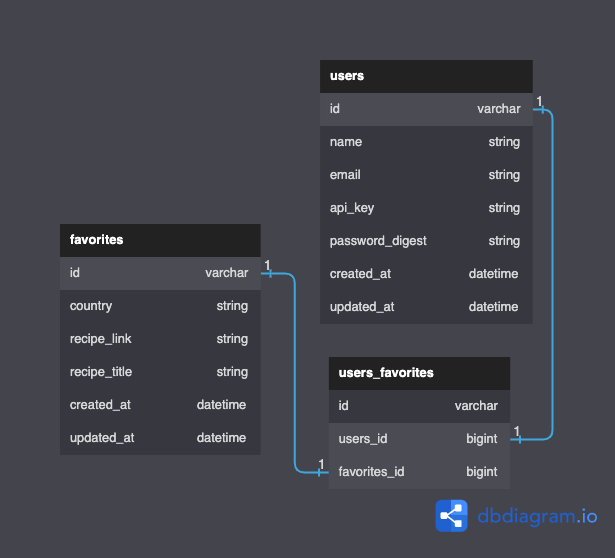
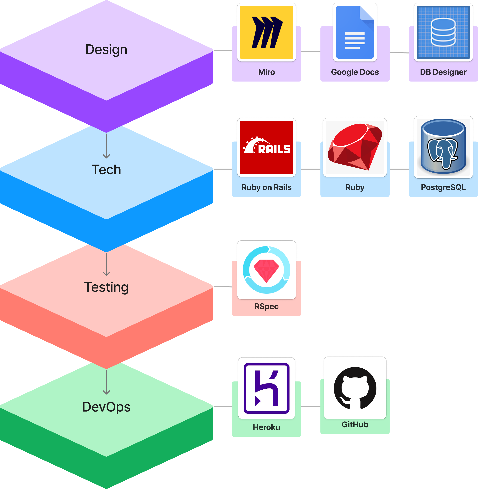

# README
<!-- PROJECT SHIELDS -->
<!--
*** I'm using markdown "reference style" links for readability.
*** Reference links are enclosed in brackets [ ] instead of parentheses ( ).
*** See the bottom of this document for the declaration of the reference variables
*** for contributors-url, forks-url, etc. This is an optional, concise syntax you may use.
*** https://www.markdownguide.org/basic-syntax/#reference-style-links
[![MIT License][license-shield]][license-url]
[![LinkedIn][linkedin-shield]][linkedin-url]
[![Stargazers][stars-shield]][stars-url]
-->

<!-- PROJECT LOGO -->
<br />
<div align="center">

  [![Contributors][contributors-shield]][contributors-url]
  [![Forks][forks-shield]][forks-url]
  [![Issues][issues-shield]][issues-url]

  <a href="https://github.com/josephhilby/lunch_and_learn">
    
  </a>

  <h3 align="center">
    <br />
    <a href="https://github.com/josephhilby/lunch_and_learn/issues">Report Bug</a>
    ·
    <a href="https://github.com/josephhilby/lunch_and_learn/issues">Request Feature</a>
  </h3>
</div>

<!-- TABLE OF CONTENTS -->
<details>
  <summary>Table of Contents</summary>
  <ol>
    <li><a href="#about-the-project">About The Project</a></li>
    <li><a href="#getting-started">Getting Started</a></li>
    <li><a href="#api-endpoints">API Endpoints</a></li>
    <li><a href="#roadmap">Roadmap</a></li>
    <li><a href="#built-with">Built With</a></li>
    <li><a href="#contact">Contact</a></li>
    <li><a href="#contributing">Contributing</a></li>
    <li><a href="#acknowledgments">Acknowledgments</li>
    <li><a href="#license">License</a></li></a>
  </ol>
</details>

<!-- ABOUT THE PROJECT -->
## About The Project

<div align="center">

  [![Product Name Screen Shot][product-screenshot]](https://example.com)

</div>

Board with your recipe book? Want to step out of your comfort zone and taste something new? This is for you.

***Lunch and Learn*** is an app that will let you find your new favorite recipe by country of origin. After you are done cooking ***Lunch and Learn*** will look up some edutainment to watch while you enjoy your new dish.

Sign up and get started!

<p align="right">(<a href="#README">back to top</a>)</p>

<!-- GETTING STARTED -->
## Getting Started

### Web Usage [Work In Progress]

This is a Ruby on Rails web application that was made for the chrome browser and for use with Google OAuth. You will need the following:

* Google Chrome
* Google account

To get started, follow the link below and register with your Google account. Once you are registered you will be able to:

* Search for recipes by country OR have ***Lunch and Learn*** select a country for you
* Play an educational video on that select county.
* Enjoy a photo album of life in that country.

### Local Installation

This application was made with the following:

* ruby '2.7.4'
* rails '5.2.8'

To install and run on your personal computer you will need to do the following:

1. Get a free API Key for EDAMAM Recipe at [https://developer.edamam.com/edamam-recipe-api](https://developer.edamam.com/edamam-recipe-api)
2. Get a free API Key for YouTube at [https://developers.google.com/youtube/v3/getting-started](https://developers.google.com/youtube/v3/getting-started)
3. Get a free API Key for Pexels at [https://www.pexels.com/api/](https://www.pexels.com/api/)
4. Fork and clone the repo to your local machine
5. Install gems

   ```sh
   $ bundle install
   $ rails db:{drop,create,migrate}
   $ bundle exec figaro install
   ```

<br />
<div align="center">
  
</div >

6. Enter your API in the `config/application.yml` file

    ```yml
    edam_app_id: <YOUR APP ID HERE>
    edam_app_key: <YOUR KEY HERE>
    yt_key: <YOUR KEY HERE>
    pexels_token: <YOUR TOKEN HERE>
    ```

7. Start your rails server in the root directory

    ```sh
    $ rails s
    ```

8. Now all you need to do is make a request to one of the endpoints. Documentation for all API Endpoints can be found below.

<p align="right">(<a href="#README">back to top</a>)</p>

<!-- ENDPOINTS -->
## API Endpoints

### GET
* `localhost:3000`/api/v1/recipes[^1]
* `localhost:3000`/api/v1/learning_resources[^2]
* `localhost:3000`/api/v1/favorites
### POST
* `localhost:3000`/api/v1/users
* `localhost:3000`/api/v1/sessions
* `localhost:3000`/api/v1/favorites
### DELETE
* `localhost:3000`/api/v1/favorites

---

### GET /api/v1/recipes?country=thailand

Get a list of recipes from a random country (if no params are passed) OR by selected country, through params.

**Parameters**

|          Name | Required |  Type   |  Description     |
| -------------:|:--------:|:-------:| ---------------- |
|     `country` |    no    | string  | The country you want to get recipes from.   |


**Response**

```
{
    "data": [
        {
            "id": null,
            "type": "recipe",
            "attributes": {
                "title": "Andy Ricker's Naam Cheuam Naam Taan Piip (Palm Sugar Simple Syrup)",
                "url": "https://www.seriouseats.com/recipes/2013/11/andy-rickers-naam-cheuam-naam-taan-piip-palm-sugar-simple-syrup.html",
                "country": "thailand",
                "image": "https://edamam-product-images.s3.amazonaws.com..."
            }
        },
        {
            "id": null,
            "type": "recipe",
            "attributes": {
                "title": "Sriracha",
                "url": "http://www.jamieoliver.com/recipes/vegetables-recipes/sriracha/",
                "country": "thailand",
                "image": "https://edamam-product-images.s3.amazonaws.com/."
            }
        },
        {...},
        {...},
        {...},
        {etc},
    ]
}
```

### GET /api/v1/learning_resources?country=laos

Get a list of learning resources from a random country (if no params are passed) OR by selected country, through params.

**Parameters**

|          Name | Required |  Type   |  Description     |
| -------------:|:--------:|:-------:| ---------------- |
|     `country` |    no    | string  | The country you want to get learning resources from.   |

**Response**

```
{
    "data": {
        "id": null,
        "type": "learning_resource",
        "attributes": {
            "country": "laos",
            "video": {
                "title": "A Super Quick History of Laos",
                "youtube_video_id": "uw8hjVqxMXw"
            },
            "images": [
                {
                    "alt_tag": "standing statue and temples landmark during daytime",
                    "url": "https://images.unsplash.com/photo-1528181304800-259b08848526?ixid=MnwzNzg2NzV8MHwxfHNlYXJjaHwxfHx0aGFpbGFuZHxlbnwwfHx8fDE2Njc4Njk1NTA&ixlib=rb-4.0.3"
                },
                {
                    "alt_tag": "five brown wooden boats",
                    "url": "https://images.unsplash.com/photo-1552465011-b4e21bf6e79a?ixid=MnwzNzg2NzV8MHwxfHNlYXJjaHwyfHx0aGFpbGFuZHxlbnwwfHx8fDE2Njc4Njk1NTA&ixlib=rb-4.0.3"
                },
                {
                    "alt_tag": "orange temples during daytime",
                    "url": "https://images.unsplash.com/photo-1563492065599-3520f775eeed?ixid=MnwzNzg2NzV8MHwxfHNlYXJjaHwzfHx0aGFpbGFuZHxlbnwwfHx8fDE2Njc4Njk1NTA&ixlib=rb-4.0.3"
                },
                {...},
                {...},
                {...},
                {etc},
              ]
        }
    }
}
```

### GET /api/v1/favorites?api_key=jgn983hy48thw9begh98h4539h4

Get a list of your user's favorite recipes.

**Parameters**

|          Name | Required |  Type   |  Description     |
| -------------:|:--------:|:-------:| ---------------- |
|     `api_key` |    yes   | string  | A unique key created after a successful POST /api/v1/users used to identify user requests   |

**Response**

```
{
    "data": [
        {
            "id": "1",
            "type": "favorite",
            "attributes": {
                "recipe_title": "Recipe: Egyptian Tomato Soup",
                "recipe_link": "http://www.thekitchn.com/recipe-egyptian-tomato-soup-weeknight....",
                "country": "egypt",
                "created_at": "2022-11-02T02:17:54.111Z"
            }
        },
        {
            "id": "2",
            "type": "favorite",
            "attributes": {
                "recipe_title": "Crab Fried Rice (Khaao Pad Bpu)",
                "recipe_link": "https://www.tastingtable.com/.....",
                "country": "thailand",
                "created_at": "2022-11-07T03:44:08.917Z"
            }
        }
    ]
 }
```

### POST /api/v1/users

Create a new user.

**Parameters (JSON payload in request body)**

```
{
  "name": "Athena Dao",
  "email": "athenadao@bestgirlever.com",
  "password": "supersecretpassword",
  "password_confirmation": "supersecretpassword"
}
```

**Response**

```
{
  "data": {
    "type": "user",
    "id": "1",
    "attributes": {
      "name": "Athena Dao",
      "email": "athenadao@bestgirlever.com",
      "api_key": "jgn983hy48thw9begh98h4539h4"
    }
  }
}
```

### POST /api/v1/sessions

Get user info for authentication use on front-end app.

**Parameters (JSON payload in request body)**

```
{
  "email": "athenadao@bestgirlever.com",
  "password": "supersecretpassword"
}
```

**Response**

```
{
  "data": {
    "type": "user",
    "id": "1",
    "attributes": {
      "name": "Athena Dao",
      "email": "athenadao@bestgirlever.com",
      "api_key": "jgn983hy48thw9begh98h4539h4"
    }
  }
}
```

### POST /api/v1/favorites

Create a new favorite recipe for the select user.

**Parameters (JSON payload in request body)**

```
{
    "api_key": "jgn983hy48thw9begh98h4539h4",
    "country": "thailand",
    "recipe_link": "https://www.tastingtable.com/.....",
    "recipe_title": "Crab Fried Rice (Khaao Pad Bpu)"
}
```

**Response**

```
{
    "success": "Favorite added successfully"
}
```

### DELETE /api/v1/favorites

Delete a selected favorite recipe for the select user.

**Parameters (JSON payload in request body)**

```
{
    "api_key": "jgn983hy48thw9begh98h4539h4",
    "country": "thailand",
    "recipe_link": "https://www.tastingtable.com/.....",
    "recipe_title": "Crab Fried Rice (Khaao Pad Bpu)"
}
```

**Response**

```
{
    "success": "Favorite removed successfully"
}
```

[^1]: Note: To changet the port, go to `config/puma.rb` and enter your desired port #: `port        ENV.fetch("PORT") { <YOUR NUMBER HERE> }`
[^2]: Note: The `:country` section in the JSON Response refers to the search criteria. If no video is found on that country, a video on a related country (by culture or geographic area) will instead be returned.

<p align="right">(<a href="#README">back to top</a>)</p>

<!-- ROADMAP -->
## Roadmap

Main Goal(s)
- [x] GET /recipes Endpoint
- [x] GET /learning_resources Endpoint
- [x] POST /users Endpoint
- [x] POST /sessions
- [ ] POST /favorites Endpoint
- [ ] GET /favorites Endpoint

Stretch Goals
- [x] Add 400 level status codes and prams check
- [x] Implement basic authentication with bcrypt
- [ ] DELETE /favorites Endpoint
- [ ] Utilize Cashing OR Background Workers

Super Stretch Goals
- [ ] Generate basic front-end
- [ ] Add Google OAuth
- [ ] Deploy to Heroku

See the [open issues](https://github.com/josephhilby/lunch_and_learn/issues) for a full list of proposed features (and known issues).

### Learning Goals
* Expose an API that aggregates data from multiple external APIs
* Expose an API that requires and authentication token
* Expose an API for CRUD functionality
* Determine completion criteria based on the needs of other developers
* Test both API consumption and exposure, making use of at least one mocking tool (VCR, Webmock)

### Evaluation Rubric
1. Technical Presentation
    * Demo understanding of learning goals
    * Demo functionality with Postman and live demo
    * Discuss technical quality & organization of code
    * Discuss test coverage, happy path, sad path, and edge cases

2. Feature Delivery
    * Complete all MVP features (Roadmap: Main Goals) as directed [here](https://backend.turing.edu/module3/projects/lunch_and_learn/requirements)
    * Complete 3 of 4 stretch goals

3. Technical Quality
    * Demonstrate good use of abstraction and encapsulation in Facades and Services
    * Demonstrate good use of Model, View, Controller (MVC) design principles

4.  Testing
    * Minimum of 90% testing coverage
    * Include all 'happy path' and 'sad path' testing
    * Include use of VCR and/or Webmock
    * Testing checks for presence of data in payload and data type

<p align="right">(<a href="#README">back to top</a>)</p>

<!-- BUILT WITH -->
## Built With

Lunch and Learn is a ***Ruby on Rails*** web application hosted on Heroku.

<br />
<div align="center">
  
</div >

<p align="right">(<a href="#README">back to top</a>)</p>

<!-- CONTACT -->
## Contact

<div align="center">
  <table>
    <tr>
      <td></td>
    </tr>
    <tr>
      <td>Joseph Hilby</td>
    </tr>
    <tr>
      <td>
        <a href="https://github.com/josephhilby">GitHub</a><br>
        <a href="https://www.linkedin.com/in/josephmhilby/">LinkedIn</a>
      </td>
    </tr>
  </table>
</div>

<p align="right">(<a href="#README">back to top</a>)</p>

<!-- CONTRIBUTING -->
## Contributing

Do you have a better & cooler way of doing what I did? Your contribution would be **greatly appreciated**.

Please fork the repo, create your branch, and create a pull request. You can also simply open an issue with the tag "enhancement".

1. Fork the Project
2. Create your Feature Branch (`git checkout -b feature/AmazingFeature`)
3. Commit your Changes (`git commit -m 'Add some AmazingFeature'`)
4. Push to the Branch (`git push origin feature/AmazingFeature`)
5. Open a Pull Request

Thanks again!

<p align="right">(<a href="#README">back to top</a>)</p>

<!-- ACKNOWLEDGMENTS -->
## Acknowledgments

* Turing School of Software Design: [https://turing.edu/](https://turing.edu/)
* DBdiagram.io [https://dbdiagram.io/home](https://dbdiagram.io/home)
* Best-README-Template: [https://github.com/othneildrew/Best-README-Template](https://github.com/othneildrew/Best-README-Template)
* API-endpoints: [https://github.com/bufferapp/README/blob/master/billing/api-endpoints.md](https://github.com/bufferapp/README/blob/master/billing/api-endpoints.md)

<p align="right">(<a href="#README">back to top</a>)</p>

<!-- LICENSE -->
## License

Distributed under the MIT License.

<p align="right">(<a href="#README">back to top</a>)</p>

<!-- MARKDOWN LINKS & IMAGES -->
<!-- https://www.markdownguide.org/basic-syntax/#reference-style-links -->
[contributors-shield]: https://img.shields.io/github/contributors/josephhilby/lunch_and_learn.svg?style=for-the-badge
[contributors-url]: https://github.com/josephhilby/lunch_and_learn/graphs/contributors
[forks-shield]: https://img.shields.io/github/forks/josephhilby/lunch_and_learn.svg?style=for-the-badge
[forks-url]: https://github.com/othneildrew/josephhilby/lunch_and_learn/network/members
[issues-shield]: https://img.shields.io/github/issues/josephhilby/lunch_and_learn.svg?style=for-the-badge
[issues-url]: https://github.com/josephhilby/lunch_and_learn/issues
[product-screenshot]: lib/images/screenshot.png
